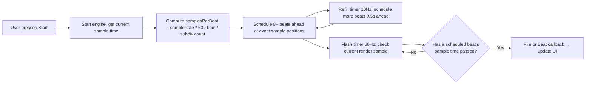

# Menu Bar Metronome

> **Current Issue:** Delayed sound / no sound on re-playing.

A lightweight, native macOS metronome that lives in your menu bar. Zero dependencies. Built with SwiftUI, `AVAudioEngine`, and sample-accurate scheduling.

https://github.com/user-attachments/assets/82c246aa-a111-479f-8f64-9a2be480909c

## Features

**Tempo & timing**
- BPM control — slider (20–300), stepper buttons, tap tempo
- Time signatures — 2/4, 3/4, 4/4, 5/4, 6/8, 7/8, 12/8
- Subdivisions — quarter, eighth, triplet, sixteenth, sextuplet
- Accented downbeat — first beat of each bar gets a louder, longer click

**Sound**
- 5 sound sets — Wood Block, Clave, Digital Beep, Rim Shot, Cowbell — all synthesized at runtime, zero audio files
- Output device selection — route audio to any connected device

**Interface**
- Visual flash — menu bar icon pulses on each beat (toggleable)
- Popover density — compact or spacious layout
- Beat dots — animated indicators of the current beat in the bar
- Persistent settings — all preferences survive relaunch

**Hotkeys**
- `⌃⌥M` toggles play/stop
- `⌃⌥T` tap tempo
- Configurable in code; require Input Monitoring permission on macOS 15+

## Build & run

### Requirements
- macOS 14 Sonoma or later
- Swift 5.10+ (comes with Command Line Tools)
- No Xcode required

### Quick start

```bash
# Build and run from source
swift run

# Or build a release .app bundle
scripts/bundle.sh
open build/Metronome.app
```

The `.app` bundle is self-contained — copy it to `/Applications` and run it.

## Usage

| Action | How |
|---|---|
| **Open popover** | Click the metronome icon in your menu bar |
| **Adjust BPM** | Slider, stepper buttons, or tap tempo |
| **Tap tempo** | Tap the "Tap" button at least twice within 2 seconds |
| **Start/Stop** | Click the green Play button (or `⌃⌥M`) |
| **Change time signature** | Select from the "Time sig" picker |
| **Change subdivision** | Select from the "Subdiv" picker |
| **Select sound** | Use the sound set picker at the bottom |
| **Open settings** | Click the gear icon — opens settings; the **X** button closes it and minimises to the menu bar |

### Settings
- **Visual flash** — toggle menu bar icon pulsing on/off
- **Accent downbeat** — first beat gets a louder accent
- **Volume** — master output level
- **Output device** — pick any audio output device
- **Popover size** — compact (280 pt wide) or spacious (340 pt wide); height fits content

### Global hotkeys

| Shortcut | Action |
|---|---|
| `⌃⌥M` | Toggle play/stop |
| `⌃⌥T` | Tap tempo |

These require the app to be running. If hotkeys don't fire on macOS 15+, grant **Input Monitoring** permission in System Settings → Privacy & Security.

## Architecture

```
┌─────────────────────────────────────────────────────────────────────────┐
│                         MetronomeApp (@main)                            │
│  SwiftUI MenuBarExtra ── popover window ── ContentView ── SettingsView  │
│        │                                                               │
│        ├── label: Image(systemName:)  (flashes "metronome.fill")        │
│        └── .menuBarExtraStyle(.window)                                 │
├─────────────────────────────────────────────────────────────────────────┤
│                         MetronomeModel (@Observable)                    │
│  Central state: bpm, isPlaying, currentBeatIndex, soundSet, etc.       │
│  Coordinates: AudioEngine, HotkeyManager, persistence                  │
├─────────────────────────────────────────────────────────────────────────┤
│   AudioEngine                        │   HotkeyManager                 │
│   ┌─────────────────────────────┐    │   ┌────────────────────────┐    │
│   │ AVAudioEngine               │    │   │ Carbon RegisterEvent-  │    │
│   │  ├── player (AVAudioPlayer) │    │   │ HotKey wrapper         │    │
│   │  └── outputNode ──→ device  │    │   │ onTogglePlay, onTap    │    │
│   │ Sample-accurate scheduling  │    │   └────────────────────────┘    │
│   │ via AVAudioTime(sampleTime) │    │                                 │
│   │ Refill timer + flash driver │    │   AudioDeviceManager            │
│   └─────────────────────────────┘    │   ┌────────────────────────┐    │
│                                       │   │ CoreAudio enumeration │    │
│   ClickSynthesizer                   │   │ kAudioHardwareProperty │    │
│   ┌─────────────────────────────┐    │   │ AUAudioUnit.deviceID  │    │
│   │ 5 sound recipes at startup │    │   └────────────────────────┘    │
│   │ → AVAudioPCMBuffer cache    │    │                                 │
│   └─────────────────────────────┘    │                                 │
└─────────────────────────────────────────────────────────────────────────┘
```

## Audio timing model

The metronome uses **sample-accurate scheduling** — the gold standard for low-jitter metronome timing.



The engine doesn't poll `Timer` for audio. Instead it pre-schedules `AVAudioPCMBuffer` objects at precise `AVAudioTime(sampleTime:)` positions. A separate 60 Hz timer reads `playerNode.lastRenderTime` to determine which beat is currently playing and fires the UI callback.

## Sound synthesis

All click sounds are generated at startup into `AVAudioPCMBuffer` instances — zero audio files are bundled.

```
Sound set     │  Recipe
──────────────┼─────────────────────────────────────────────
Wood Block    │  sines 1500Hz + 2200Hz, 40ms exp decay
Clave         │  triangle 2500Hz with pitch droop, 30ms
Digital Beep  │  square 1000Hz + noise transient, 25ms
Rim Shot      │  filtered noise burst, 15ms
Cowbell       │  sines 800Hz + 540Hz, 60ms with overtone decay
```

Downbeat accent = +3 dB gain, ×1.4 decay length.
Subdivision = −6 dB, ×0.5 decay length.

## Project structure

```
menu-bar-metronome/
├── Package.swift              # SPM executable, macOS 14+, strict concurrency
├── README.md
├── Resources/
│   ├── Info.plist             # LSUIElement=YES, bundle metadata
│   └── Metronome.entitlements # hardened runtime (no sandbox)
├── scripts/
│   └── bundle.sh              # Builds release → assembles Metronome.app
└── Sources/Metronome/
    ├── MetronomeApp.swift     # @main, MenuBarExtra, status icon flash
    ├── ContentView.swift      # Main popover: BPM, beats, controls
    ├── SettingsView.swift     # Sub-view: flash, accent, volume, device
    ├── Models/
    │   ├── MetronomeModel.swift   # @Observable central state, persistence
    │   ├── TimeSignature.swift
    │   ├── Subdivision.swift
    │   ├── SoundSet.swift
    │   └── PopoverDensity.swift
    ├── Audio/
    │   ├── AudioEngine.swift       # AVAudioEngine, scheduling, flash driver
    │   ├── ClickSynthesizer.swift  # Generates PCM buffers per sound set
    │   └── AudioDeviceManager.swift # CoreAudio device enumeration
    └── Hotkeys/
        └── HotkeyManager.swift     # Carbon EventHotKey wrapper
```

## Security model

This app is **unsandboxed** with **hardened runtime** and **ad-hoc signed**. It's a local utility with no network access, no file I/O, and no sensitive data. The only permissions it requires are:

- Audio output (always granted — no prompt)
- Input Monitoring (only for global hotkeys — prompted on first use if needed)

Unsandboxed status is required for reliable Carbon `RegisterEventHotKey` support and audio device routing. This matches all major macOS menu bar utilities (Bartender, iStat Menus, etc.).

## Dependencies

**Zero.** The entire app uses only system frameworks:
- SwiftUI
- AVFAudio / CoreAudio
- Carbon (hotkeys)

No CocoaPods, no SPM packages, no Electron. The release binary is ~530 KB.

## License

MIT
